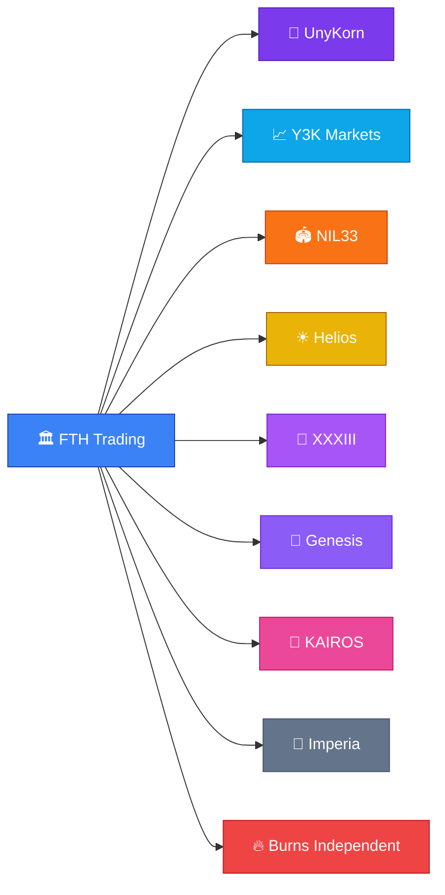
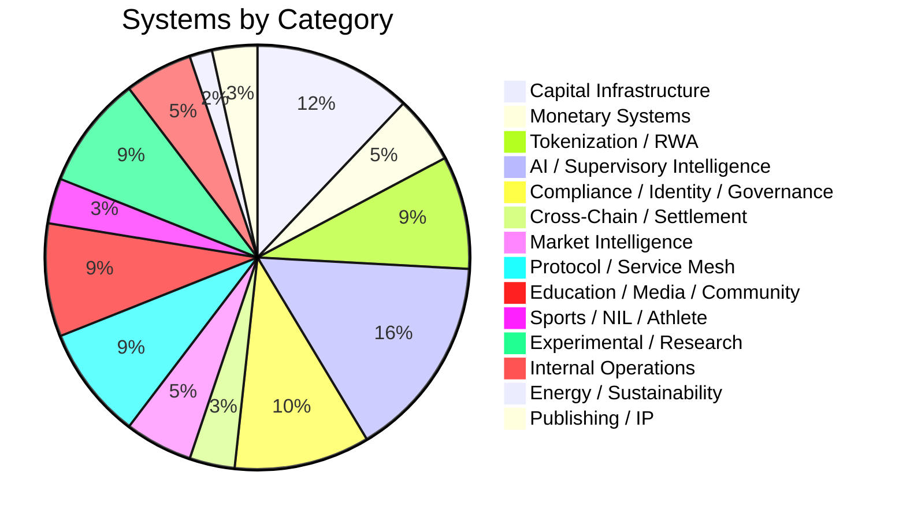
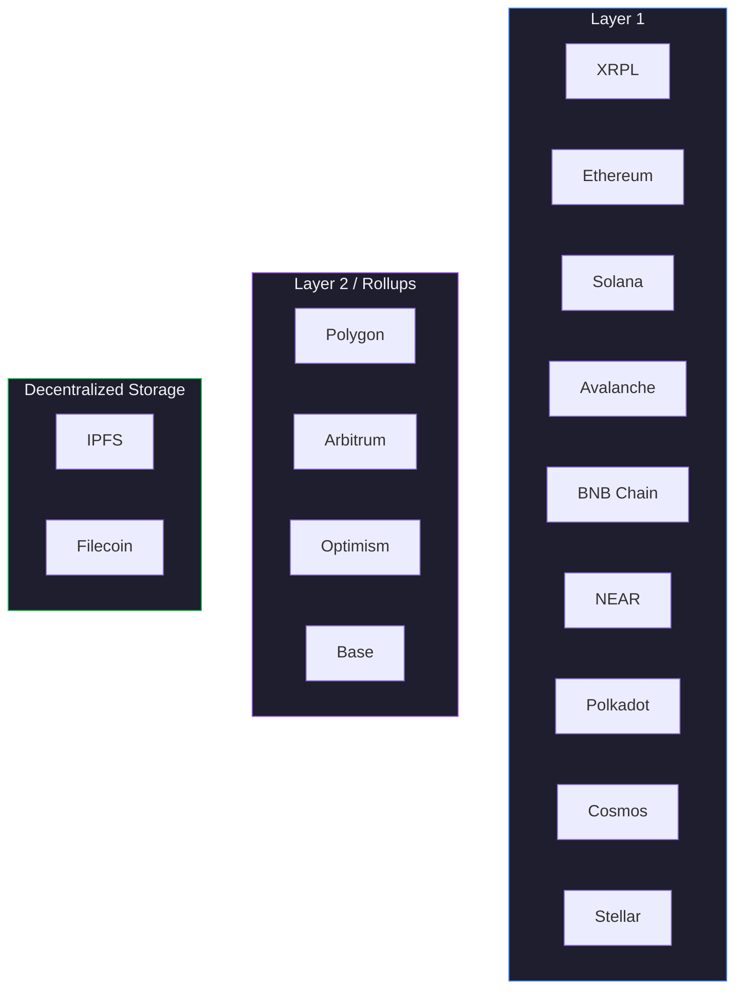
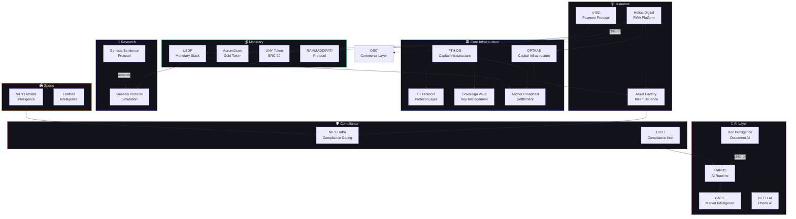
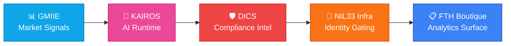
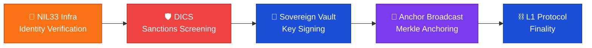

<p align="center">
  
  
  
  
  
</p>

<h1 align="center">🦄 KEVAN BURNS EMPIRE</h1>
<h3 align="center">Canonical Infrastructure Atlas &amp; Operating Map</h3>
<p align="center"><em>The single source of truth for every system, protocol, and platform across the UnyKorn / FTH Trading / Burns ecosystem.</em></p>

<p align="center">
  <a href="https://portfolio.unykorn.org/systems/">🔭 Atlas</a> ·
  <a href="https://portfolio.unykorn.org/control/">⚡ Control Plane</a> ·
  <a href="https://portfolio.unykorn.org/">🏠 Home</a>
</p>

---

## 🔗 Live Links — Copy & Paste

> Every live URL in the ecosystem. Copy any line directly.

```text
── PORTFOLIO ──────────────────────────────────────────────────
https://portfolio.unykorn.org/
https://portfolio.unykorn.org/systems/
https://portfolio.unykorn.org/control/
https://portfolio.unykorn.org/blog/
https://portfolio.unykorn.org/services/
https://portfolio.unykorn.org/press/

── FLAGSHIPS ──────────────────────────────────────────────────
https://fth-os.netlify.app/                  FTH Trading Platform
https://genesis.unykorn.org/                 Genesis Protocol
https://heliosdigital.xyz/                   Helios Digital
https://unykorn.org/                         UNYKORN Sovereign Grid
https://imperia-platform.netlify.app/        Imperia Platform
https://optkas.org/                          OPTKAS
https://xxxiii-io.pages.dev/                 GMIIE
https://nil33.com/                           NIL33 Athlete Intelligence

── LIVE SYSTEMS ───────────────────────────────────────────────
https://y3kmarkets.com/                      Y3K Markets
https://xxxiii.io/library                    XXXIII Capital Layer
https://docs.unykorn.org/                    Doc Intelligence Engine
https://fthtrading.github.io/University/     Fitzherbert University
https://fthtrading.github.io/boutique/       FTH Commodity Platform
https://mensofgod.com/                       Vaughan Capital Advisory
https://super-s.pages.dev/                   SUPER-S Infrastructure Guide
https://dr.optkas.org/                       DR Infrastructure Convergence
https://ram.unykorn.org/                     RAMMADDIPATI Protocol
https://x402.unykorn.org/                    x402 Protocol
https://gold.unykorn.org/                    AurumGram (AURG)
https://avax.unykorn.org/                    UNY Token
https://needai.y3kmarkets.com/              NEED AI
https://drunks.app/                          Drunks App
https://fthtrading.github.io/X407/           X407

── GITHUB ─────────────────────────────────────────────────────
https://github.com/FTHTrading/kevan-burns-empire-
```

---

## 📑 Table of Contents

| Section | Description |
| --------- | ------------- |
| [🔗 Live Links](#-live-links--copy--paste) | Every live URL — copy & paste ready |
| [🏗 Architecture](#-architecture) | Stack, build pipeline, and project structure |
| [🗂 System Registry](#-system-registry--57-systems) | Complete catalog of all 57 systems |
| [🏢 Brands](#-brands--10) | The 10 operating brands |
| [📊 Categories](#-categories--14) | 14 system categories with color codes |
| [⛓ Chains](#-chains--15) | 15 blockchain targets |
| [🔬 Maturity Model](#-maturity-model--10-levels) | 10-level maturity classification |
| [🌐 Infrastructure Layers](#-infrastructure-layers) | 10-layer stack architecture |
| [🗺 Dependency Graph](#-dependency-graph) | System-to-system relationships |
| [💰 Capital Flow](#-capital-flow) | How capital moves through the ecosystem |
| [🤖 AI Supervision Flow](#-ai-supervision-flow) | Intelligence propagation chain |
| [🛡 Compliance Flow](#-compliance--proof-flow) | Identity, compliance, and proof rail |
| [📐 Featured Collections](#-featured-collections) | Curated system groupings |
| [🚀 Quick Start](#-quick-start) | Build and run locally |
| [📦 Deployment](#-deployment) | Static export to IPFS / Vercel / Netlify |

---

## 🏗 Architecture

```text
┌──────────────────────────────────────────────────────────────┐
│                    KEVAN BURNS EMPIRE                         │
│              Next.js 14 · React 18 · TypeScript 5            │
│            Tailwind CSS · Framer Motion · Static Export       │
├──────────────────────────────────────────────────────────────┤
│  ┌──────────┐  ┌──────────┐  ┌──────────┐  ┌──────────┐     │
│  │  /home   │  │ /systems │  │ /control │  │  /blog   │     │
│  │ Portfolio │  │  Atlas   │  │  Ops Map │  │ Content  │     │
│  └────┬─────┘  └────┬─────┘  └────┬─────┘  └────┬─────┘     │
│       │              │              │              │          │
│  ┌────┴──────────────┴──────────────┴──────────────┴─────┐   │
│  │                 Shared Component Layer                  │   │
│  │  Atlas Badges · SystemCard · FilterBar · SystemDetail  │   │
│  │  EcosystemStats · DependencyGraph · ControlDashboard   │   │
│  └────────────────────────┬──────────────────────────────┘   │
│                           │                                   │
│  ┌────────────────────────┴──────────────────────────────┐   │
│  │              Canonical Data Layer                       │   │
│  │  systems.ts (57) · categories.ts · chains.ts           │   │
│  │  brands.ts · featured.ts · atlas.ts (utilities)        │   │
│  └────────────────────────┬──────────────────────────────┘   │
│                           │                                   │
│  ┌────────────────────────┴──────────────────────────────┐   │
│  │              Type System (system.ts)                    │   │
│  │  System · EcosystemMetrics · DependencyEdge            │   │
│  │  MaturityLevel · SystemCategory · Chain · Brand         │   │
│  └───────────────────────────────────────────────────────┘   │
└──────────────────────────────────────────────────────────────┘
```

### Project Structure

```text
kevan-burns-empire/
├── src/
│   ├── app/
│   │   ├── page.tsx                 # Homepage / Portfolio
│   │   ├── layout.tsx               # Root layout (dark theme, JSON-LD)
│   │   ├── globals.css              # Global styles
│   │   ├── systems/
│   │   │   ├── page.tsx             # /systems — Atlas grid
│   │   │   └── [slug]/page.tsx      # /systems/:slug — Detail pages (57)
│   │   ├── control/
│   │   │   └── page.tsx             # /control — Control Plane
│   │   ├── blog/
│   │   │   ├── page.tsx             # Blog index
│   │   │   └── [slug]/page.tsx      # Blog post pages
│   │   ├── services/page.tsx        # Services page
│   │   └── press/page.tsx           # Press page
│   ├── components/
│   │   ├── atlas/                   # Atlas component library
│   │   │   ├── SystemCard.tsx       # Animated system card
│   │   │   ├── SystemDetail.tsx     # Full system detail view
│   │   │   ├── SystemsGrid.tsx      # Filterable grid + search
│   │   │   ├── FilterBar.tsx        # Search, filter, sort controls
│   │   │   ├── EcosystemStats.tsx   # Aggregate metrics banner
│   │   │   ├── CategoryBadge.tsx    # Color-coded category badge
│   │   │   ├── ChainBadge.tsx       # Chain target badge
│   │   │   ├── MaturityBadge.tsx    # Maturity level badge
│   │   │   └── BrandBadge.tsx       # Brand affiliation badge
│   │   ├── control/                 # Control Plane components
│   │   │   ├── ControlDashboard.tsx # Main dashboard client component
│   │   │   ├── StatusTable.tsx      # System status matrix
│   │   │   ├── DependencyGraph.tsx  # Dependency visualization
│   │   │   ├── MaturityChart.tsx    # Maturity distribution chart
│   │   │   └── CapitalView.tsx      # Revenue / monetization view
│   │   ├── Hero.tsx                 # Homepage hero
│   │   ├── Navbar.tsx               # Navigation bar
│   │   ├── Footer.tsx               # Footer
│   │   └── ...                      # Other homepage sections
│   ├── content/
│   │   ├── systems.ts               # 📦 THE REGISTRY — 57 systems
│   │   ├── categories.ts            # 14 category definitions
│   │   ├── chains.ts                # 15 chain definitions
│   │   ├── brands.ts                # 10 brand definitions
│   │   └── featured.ts              # Featured collections & pathways
│   ├── lib/
│   │   └── atlas.ts                 # Search, filter, sort, metrics
│   └── types/
│       └── system.ts                # Canonical type system (~400 lines)
├── next.config.mjs                  # Static export config
├── tailwind.config.ts               # Dark theme + empire palette
├── package.json
└── tsconfig.json
```

### Tech Stack

| Layer | Technology | Purpose |
| ------- | ----------- | --------- |
| **Framework** | Next.js 14.2 | Static site generation, App Router |
| **Language** | TypeScript 5 | Full type safety across entire registry |
| **UI** | React 18 | Component-based UI |
| **Styling** | Tailwind CSS 3.4 | Utility-first dark theme |
| **Animation** | Framer Motion 12 | Scroll-triggered + staggered animations |
| **Icons** | Lucide React | Consistent icon set |
| **Export** | Static HTML/CSS/JS | IPFS / Vercel / Netlify / Cloudflare |

---

## 🗂 System Registry — 57 Systems

> Every system is registered once in `src/content/systems.ts` and appears automatically across the Atlas, Control Plane, detail pages, dependency graph, and all filters.

### 🔴 Flagships

| # | System | Brand | Category | Status | Live URL |
| --- | -------- | ------- | ---------- | -------- | ---------- |
| 1 | 🏛 **FTH Trading Platform** | FTH Trading | Capital Infrastructure | 🟢 Live | https://fth-os.netlify.app/ |
| 2 | 🧬 **Genesis Protocol** | Genesis | Experimental / Research | 🟢 Live | https://genesis.unykorn.org/ |
| 3 | ☀ **Helios Digital** | Helios | Tokenization / RWA | 🟢 Live | https://heliosdigital.xyz/ |
| 4 | 🦄 **UNYKORN Sovereign Grid** | UnyKorn | Protocol / Service Mesh | 🟢 Live | https://unykorn.org/ |
| 5 | 🏰 **Imperia Platform** | Imperia | Internal Operations | 🟢 Live | https://imperia-platform.netlify.app/ |
| 6 | 🏦 **OPTKAS** | FTH Trading | Capital Infrastructure | 🟢 Live | https://optkas.org/ |
| 7 | 📊 **GMIIE** | XXXIII | Market Intelligence | 🟢 Live | https://xxxiii-io.pages.dev/ |
| 8 | 🏟 **NIL33 Athlete Intelligence** | NIL33 | Sports / NIL / Athlete | 🟢 Live | https://nil33.com/ |

### 🟢 Live Systems

| # | System | Brand | Category | Live URL |
| --- | -------- | ------- | ---------- | ---------- |
| 9 | Y3K Markets | Y3K Markets | AI / Supervisory Intelligence | https://y3kmarkets.com/ |
| 10 | XXXIII Capital Layer | XXXIII | Capital Infrastructure | https://xxxiii.io/library |
| 11 | KAIROS | KAIROS | AI / Supervisory Intelligence | — |
| 12 | DICS Compliance Intelligence | FTH Trading | Compliance / Identity / Governance | — |
| 13 | Doc Intelligence Engine | KAIROS | AI / Supervisory Intelligence | https://docs.unykorn.org/ |
| 14 | DonkAI | UnyKorn | AI / Supervisory Intelligence | — |
| 15 | Policy Integrity Engine | FTH Trading | Compliance / Identity / Governance | — |
| 16 | Anchor Broadcast Network | FTH Trading | Cross-Chain / Settlement | — |
| 17 | L1 Protocol Layer | FTH Trading | Protocol / Service Mesh | — |
| 18 | Sovereign Service Mesh | FTH Trading | Protocol / Service Mesh | — |
| 19 | Sovereign Vault | FTH Trading | Protocol / Service Mesh | — |
| 20 | Fitzherbert University | FTH Trading | Education / Media / Community | https://fthtrading.github.io/University/ |
| 21 | FTH Commodity Platform | FTH Trading | Capital Infrastructure | https://fthtrading.github.io/boutique/ |
| 22 | LPS-1 Publishing Protocol | XXXIII | Publishing / IP | — |
| 23 | The 2,500 Donkeys | XXXIII | Publishing / IP | — |
| 24 | SUPER-S Infrastructure Guide | FTH Trading | Experimental / Research | https://super-s.pages.dev/ |
| 25 | Asset Factory OS | FTH Trading | Tokenization / RWA | — |
| 26 | Solana Token Launcher | FTH Trading | Tokenization / RWA | — |
| 27 | DR Infrastructure Convergence | FTH Trading | Market Intelligence | https://dr.optkas.org/ |
| 28 | RAMMADDIPATI Protocol | FTH Trading | Monetary Systems | https://ram.unykorn.org/ |
| 29 | UnyKorn 7777 | UnyKorn | Tokenization / RWA | — |
| 30 | x402 Protocol | FTH Trading | Cross-Chain / Settlement | https://x402.unykorn.org/ |
| 31 | AurumGram (AURG) | Helios | Tokenization / RWA | https://gold.unykorn.org/ |
| 32 | Vaughan Capital Advisory | FTH Trading | Capital Infrastructure | https://mensofgod.com/ |
| 33 | UNY Token | UnyKorn | Monetary Systems | https://avax.unykorn.org/ |
| 34 | NEED AI | Y3K Markets | AI / Supervisory Intelligence | https://needai.y3kmarkets.com/ |
| 35 | Drunks App | Burns Independent | Education / Media / Community | https://drunks.app/ |
| 36 | X407 | FTH Trading | AI / Supervisory Intelligence | https://fthtrading.github.io/X407/ |

### 🟡 In Development

| # | System | Brand | Category | Maturity |
| --- | -------- | ------- | ---------- | ---------- |
| 37 | USDF Monetary Stack | FTH Trading | Monetary Systems | Testnet |
| 38 | NIL33 Infrastructure | NIL33 | Compliance / Identity / Governance | Audit Mode |
| 39 | VS Identity OS | FTH Trading | Compliance / Identity / Governance | Prototype |
| 40 | NIL Transparency Network | NIL33 | Compliance / Identity / Governance | Prototype |
| 41 | Football Intelligence | NIL33 | Sports / NIL / Athlete | Prototype |
| 42 | SunFarm Energy Layer | Helios | Energy / Sustainability | Testnet |
| 43 | Genesis Sentience Protocol | Genesis | AI / Supervisory Intelligence | Prototype |
| 44 | Drone GNC Framework | FTH Trading | Experimental / Research | Prototype |
| 45 | Spectral Ledger | FTH Trading | Experimental / Research | Prototype |
| 46 | Gravity Engine | FTH Trading | Experimental / Research | Thesis |
| 47 | Global Truth | FTH Trading | Compliance / Identity / Governance | Thesis |
| 48 | X407 | FTH Trading | AI / Supervisory Intelligence | Designed |
| 49 | SGE | UnyKorn | Compliance / Identity / Governance | Prototype |
| 50 | SGE Alignment OS | UnyKorn | AI / Supervisory Intelligence | Prototype |
| 51 | Cricket | FTH Trading | Protocol / Service Mesh | Prototype |
| 52 | Freelance Command Center | FTH Trading | Internal Operations | Internal |
| 53 | FTH Documentation Hub | FTH Trading | Internal Operations | Internal |
| 54 | Drunks App | Burns Independent | Education / Media / Community | Pilot |
| 55 | Helios Video Gen | Helios | Education / Media / Community | Prototype |
| 56 | Popeye-Tars-Mars-Tev | UnyKorn | AI / Supervisory Intelligence | Prototype |
| 57 | AIF — Autonomous Investment Fund | FTH Trading | Capital Infrastructure | Prototype |
| 58 | OPTKAS Bank VI | FTH Trading | Market Intelligence | Prototype |
| 59 | AxlUSD Structured Finance | Y3K Markets | Capital Infrastructure | Designed |

---

## 🏢 Brands — 10



| Brand | Systems | Focus Area |
| ------- | --------- | ------------ |
| 🏛 **FTH Trading** | 26 | Capital infrastructure, protocol mesh, compliance |
| 🦄 **UnyKorn** | 7 | Sovereign grid, governance, tokenization |
| 📈 **Y3K Markets** | 3 | Career OS, AI phone infrastructure, structured finance |
| 🏟 **NIL33** | 4 | Sports analytics, athlete intelligence, NIL compliance |
| ☀ **Helios** | 3 | Tokenization, energy, video generation |
| 💎 **XXXIII** | 4 | Capital layer, market intelligence, publishing |
| 🧬 **Genesis** | 2 | Protocol research, sentience simulation |
| 🤖 **KAIROS** | 2 | AI supervisory runtime, document intelligence |
| 🏰 **Imperia** | 1 | Operational command platform |
| 🔥 **Burns Independent** | 1 | Community, culture, experimental |

---

## 📊 Categories — 14



| Color | Category | Systems | Description |
| ------- | ---------- | --------- | ------------- |
| 🔵 | Capital Infrastructure | 7 | Vaults, treasury, issuance rails, institutional capital flow |
| 🟢 | Monetary Systems | 3 | Reserve-backed stablecoins, deterministic mint/burn |
| 🟣 | Tokenization / RWA | 5 | Real-world asset tokenization, digital securities |
| 🩷 | AI / Supervisory Intelligence | 9 | Sovereign AI, agentic RAG, voice runtime, doc intelligence |
| 🔴 | Compliance / Identity / Governance | 6 | ZK compliance, KYC/AML, identity proofs |
| 🟪 | Cross-Chain / Settlement | 2 | Multi-chain broadcast, Merkle proof settlement |
| 🩵 | Market Intelligence / Analytics | 3 | Surveillance, flow detection, sentiment |
| 🔷 | Protocol / Service Mesh | 5 | Protocol layers, node sync, service contracts |
| 🩶 | Education / Media / Community | 5 | Education platforms, media, community |
| 🟠 | Sports / NIL / Athlete | 2 | Athlete valuation, NCAA compliance, NIL tracking |
| 💜 | Experimental / Research | 5 | Simulation engines, prototype environments |
| ⬜ | Internal Operations | 3 | Internal tooling, documentation |
| 🟡 | Energy / Sustainability | 1 | Renewable energy, tokenized RECs |
| 💚 | Publishing / IP | 2 | Deterministic publishing, on-chain IP |

---

## ⛓ Chains — 15



---

## 🔬 Maturity Model — 10 Levels

```text
 ┌─────────────────────────────────────────────────────────────────┐
 │                    MATURITY PROGRESSION                          │
 ├───────────┬──────────┬──────────┬──────────┬───────────┐        │
 │  THESIS   │ DESIGNED │PROTOTYPE │ INTERNAL │  TESTNET  │        │
 │  ░░░░░░░  │ ▒▒▒▒▒▒▒  │ ▓▓▓▓▓▓▓  │ ████░░░  │ █████░░  │        │
 │  #64748b  │ #818cf8  │ #a78bfa  │ #f59e0b  │ #38bdf8  │        │
 ├───────────┼──────────┼──────────┼──────────┼───────────┤        │
 │   PILOT   │   LIVE   │PRODUCTION│AUDIT MODE│ ARCHIVED  │        │
 │  ██████░  │ ███████  │ ████████ │ 🔴🔴🔴🔴  │ ⬜⬜⬜⬜   │        │
 │  #22d3ee  │ #22c55e  │ #10b981  │ #ef4444  │ #6b7280   │        │
 └───────────┴──────────┴──────────┴──────────┴───────────┘        │
 └─────────────────────────────────────────────────────────────────┘
```

| Level | Color | Count | Description |
| ------- | ------- | ------- | ------------- |
| Thesis | `#64748b` | 2 | Concept documented, no code |
| Designed | `#818cf8` | 2 | Architecture defined, pre-development |
| Prototype | `#a78bfa` | 13 | Early code, not deployed |
| Internal | `#f59e0b` | 2 | Running internally, not public |
| Testnet | `#38bdf8` | 2 | Deployed to test networks |
| Pilot | `#22d3ee` | 1 | Limited external access |
| **Live** | `#22c55e` | **33** | **Publicly accessible and operational** |
| Production | `#10b981` | 0 | Enterprise-grade, SLA-backed |
| Audit Mode | `#ef4444` | 1 | Under formal compliance review |
| Archived | `#6b7280` | 0 | Sunset or deprecated |

---

## 🌐 Infrastructure Layers

The full ecosystem is organized into 10 infrastructure layers, from research at the bottom to media/brand at the top:

```text
 ┌─────────────────────────────────────────────────────────────────┐
 │                                                                  │
 │   10. Media / Education / Brand                                  │
 │       Fitzherbert University · Drunks App                        │
 │                                                                  │
 │    9. Governance & Policy                                        │
 │       SGE · NIL Transparency · Global Truth                      │
 │                                                                  │
 │    8. Service Mesh & Protocol                                    │
 │       UNYKORN Grid · L1 Protocol · Sovereign Mesh · Cricket      │
 │                                                                  │
 │    7. Data & Intelligence                                        │
 │       GMIIE · DR Intelligence · OPTKAS Bank VI                   │
 │                                                                  │
 │    6. Broadcast & Settlement                                     │
 │       Anchor Broadcast · x402 Protocol                           │
 │                                                                  │
 │    5. Treasury & Capital Operations                              │
 │       FTH OS · OPTKAS · XXXIII Capital · AIF · FTH Boutique     │
 │                                                                  │
 │    4. Issuance & Tokenization                                    │
 │       Helios · Asset Factory · AURG · UnyKorn 7777 · Solana     │
 │                                                                  │
 │    3. Compliance & Identity                                      │
 │       NIL33 · DICS · Policy Integrity · VS Identity              │
 │                                                                  │
 │    2. Supervisory AI                                             │
 │       KAIROS · Doc Intelligence · DonkAI · NEED AI · X407       │
 │                                                                  │
 │    1. Research & Simulation                                      │
 │       Genesis Protocol · Spectral Ledger · Drone GNC · Gravity  │
 │                                                                  │
 └─────────────────────────────────────────────────────────────────┘
```

---

## 🗺 Dependency Graph

The core system-to-system dependency map. Arrows represent `depends-on`, `extends`, `integrates-with`, and `child-of` relationships.



---

## 💰 Capital Flow

How capital moves through the ecosystem:

```mermaid
flowchart LR
    A["🏦 FTH OS<br/>Structuring"] --> B["🏛 OPTKAS<br/>Facility Design"]
    B --> C["📦 Asset Factory<br/>Tokenization"]
    C --> D["📈 Y3K Markets<br/>Distribution"]
    D --> E["💵 USDF<br/>Settlement"]
    E --> F["☀ Helios<br/>Activation"]
    F --> G["📡 Anchor Broadcast<br/>Finality"]
    
    style A fill:#3b82f6,stroke:#1e40af,color:#fff
    style B fill:#3b82f6,stroke:#1e40af,color:#fff
    style C fill:#a855f7,stroke:#7e22ce,color:#fff
    style D fill:#0ea5e9,stroke:#0369a1,color:#fff
    style E fill:#10b981,stroke:#059669,color:#fff
    style F fill:#eab308,stroke:#a16207,color:#fff
    style G fill:#7c3aed,stroke:#5b21b6,color:#fff
```



---

## 🤖 AI Supervision Flow

How intelligence propagates through the stack:



---

## 🛡 Compliance & Proof Flow

How compliance assertions propagate:



---

## 📐 Featured Collections

### The Flagship Five
> The five core systems that define the infrastructure stack.

`FTH OS` → `Genesis Protocol` → `Helios` → `UNYKORN` → `Imperia`

### Capital Infrastructure Stack
> End-to-end capital flow: issuance, tokenization, settlement, vault, and monetary operations.

`FTH OS` → `USDF` → `Asset Factory` → `Y3K Markets` → `OPTKAS` → `Helios`

### AI Intelligence Layer
> The full supervisory AI stack.

`KAIROS` → `GMIIE` → `DICS` → `NIL33 Athlete` → `FTH Boutique`

### Compliance & Proof Rail
> Identity, compliance, settlement broadcasting, and sovereign key management.

`NIL33 Infra` → `DICS` → `Anchor Broadcast` → `Sovereign Vault`

### Research Frontier
> Research-grade systems: simulation engines, protocol testing, aerospace guidance.

`Genesis Protocol` → `SUPER-S` → `Drone GNC`

---

## 🚀 Quick Start

```bash
# Clone
git clone https://github.com/FTHTrading/kevan-burns-empire-.git
cd kevan-burns-empire-

# Install dependencies
npm install

# Development
npm run dev          # Start dev server at http://localhost:3000

# Build
npm run build        # Static export → /out directory

# Lint
npm run lint
```

### Key Pages

| Route | Description |
| ------- | ------------- |
| `/` | Homepage — portfolio, capabilities, services |
| `/systems` | **Atlas** — browse, filter, search all 57 systems |
| `/systems/:slug` | **System Detail** — full view of any system |
| `/control` | **Control Plane** — operational status, dependencies |
| `/blog` | Blog index |
| `/services` | Services page |
| `/press` | Press page |

---

## 📦 Deployment

### Static Export (IPFS)

```powershell
# Build and deploy to IPFS
npm run build
./deploy-ipfs.ps1
```

### Vercel / Netlify / Cloudflare Pages

Push to `main` and connect the repo. The build command is `npm run build` with output directory `out/`.

### Configuration

| Setting | Value |
| --------- | ------- |
| Output | Static (`output: 'export'`) |
| Trailing Slash | `true` |
| Images | Unoptimized (static) |
| Base Path | `/` |

---

## 🔑 Design System

| Token | Value | Usage |
| ------- | ------- | ------- |
| Background | `#0a0a0f` | Page background |
| Card | `#12121a` | Card surfaces |
| Border | `#1e1e2e` | Subtle borders |
| Text | `#f0f0f5` | Primary text |
| Muted | `#8888a0` | Secondary text |
| Accent | `#3b82f6` | Blue primary |
| Font | Inter | System font |
| Animations | Framer Motion | Scroll-triggered, staggered |

---

<p align="center">
  <strong>Built by Kevan Burns</strong><br/>
  <em>FTH Trading · UnyKorn · XXXIII · NIL33 · Helios · Y3K Markets</em>
</p>

<p align="center">
  <sub>57 systems · 10 brands · 14 categories · 15 chains · one infrastructure</sub>
</p>
